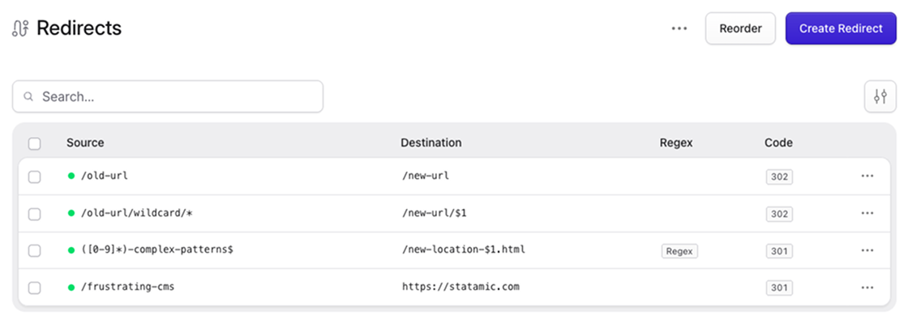

<!-- statamic:hide -->

# Statamic Simple Redirects

Simple, lightweight redirect management for Statamic CMS.



<!-- /statamic:hide -->

## Overview

This addon lets you create and manage redirects for 404 pages directly from the Statamic Control Panel.
It is simple by design, focusing on the essentials with a clean and straightforward setup.

If you need more advanced features like analytics or automatic redirect creation, take a look at the excellent [Redirect addon](https://github.com/riasvdv/statamic-redirect) by Rias.

## Features

- **Native Control Panel UI**  
  Seamlessly integrated and visually aligned with Statamic v6

- **Redirect Management**  
  Create and manage redirects directly in the Control Panel

- **Flat File & Database Support**  
  Works with Statamic’s default flat-file driver and the Eloquent driver

- **Wildcard & Regex Redirects**  
  Flexible URL matching for more advanced redirect rules

- **Multi-Site Support**  
  Compatible with Statamic multi-site setups

- **CSV Import & Export**  
  Easily import and export redirects using CSV files

## Installation

Require it using Composer:

```bash
composer require ndx/statamic-simple-redirects
```

## Configuration

Publish the configuration file:

```bash
php artisan vendor:publish --tag=simple-redirects-config
```

### Storage Drivers

By default, redirects are stored as flat files in `content/redirects/`. To switch to database storage, follow these steps:

#### 1. Update the driver configuration

```php
// config/statamic/redirects.php

'driver' => 'eloquent',
```

#### 2. Publish the migration

```bash
php artisan vendor:publish --tag=simple-redirects-migrations
```

#### 3. Run migrations and clear the cache

```bash
php artisan migrate
php artisan cache:clear
```

> **Note:** Switching drivers does not automatically migrate existing redirects. If you have existing flat-file redirects, you'll need to recreate them manually or export them to CSV first and re-import after switching.

## How to Use

### Permissions

This addon registers a `manage redirects` permission. For non-admin users, this permission must be enabled in their role before they can access the redirects section.

### Wildcard Redirects

The default match type supports wildcards using `*`:

- `/old-blog/*` → `/blog/$1`
- `/products/*/details` → `/shop/$1/info`

### Regex Redirects

For advanced patterns, enable the Regex option:

- Source: `^/blog/(\d{4})/(.*)$`
- Destination: `/archive/$1/$2`

### Import/Export

Redirects can be imported and exported as CSV files directly from the Control Panel.

The importer supports various CSV formats, but at least `source` and `destination` columns are required.

## About Us

We're a digital agency building web applications with Laravel and websites with Statamic – from initial concept to long-term maintenance.

[new-data-services.de](https://new-data-services.de/)
